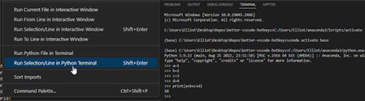

# The Problem
A frequent part of the data science workflow is executing a portion of SomePythonScript.py, and working with the results interactively. Currently in vscode, you have 3 options to do this:

* (1) highlight code and "Run Selection/Line in Interactive Terminal"

* (2) highlight code and "Run Selection/Line in Python Terminal"
img
* (3) highlight code and "Run Selection/Line in Python Terminal" with this [popular setting](https://stackoverflow.com/questions/52310689/use-ipython-repl-in-vs-code) to call iPython instead of "vanilla" python.
img

However, all 3 options have critical flaws and do not behave how data scientists have become accustomed to in popular IDEs (ex. spyder, Rstudio, iPython/QTconsole, Pycharm)

* Method 1's flaw: Fast code execution, *but* up/down arrow don't scroll through your code history. [see note 1]
* Method 2's flaw: up/down arrow scroll through your code history line-by-line, instead of the entire code chunks (basiscally useless in practice). Also, no syntax coloring.
* Method 3's flaw: has command history and syntax coloring *BUT extremely slow!* See performance comparisons below. 

# The Solution / My Method
For my script to work, I assume 3 things:
1. You have autohotkey v1.1 installed and *betterSendToPythonTerminal.ahk* is in your windows startup folder
2. Your keyboard shortcut for `Terminal: Focus Terminal` is `ctrl+tick/tilde`.
add this to your keybindings.json: `{"key": "ctrl+`", "command": "workbench.action.terminal.focus"}` 
3. You have already ipython terminal open in vscode. [see note 2]

# Advantages
Now `shift+enter` behaves exactly as all data scientists expect, à la Spyder/Pycharm/Rstudio!
|               | Code History? | speedBenchmark.py |
|---------------|---------------|-------------------|
| **method 1**  |       ❌       |       ✔️            |
| **method 2**  |        ❌     |     ❌              |
| **method 3**  |       ✔️        |       ❌            |
| **THIS METHOD** |      ✔️        |        ✔️           |

## Appendix: Pre-requisite Steps to Re-create the Problem

1. install Anaconda3-2022.10-Windows-x86_64.exe *
2. install VSCodeUserSetup-x64-1.74.3.exe *
3. install Python extension v2022.20.2 *
*most recent version available as of 2022-01-16*

## Appendix: Footnotes

[1] Actually command history exists via `interactive.history.next` and `interactive.history.previous` (but the default hotkeys up/down are being overridden by other hotkeys with higher precedence!). Even if you happen to discover these, and re-bind them to new, non-conflicting hotkeys, they still don't behave correctly. Vscode is such a mess!

[2] I added *~\anaconda3\Scripts\* to my windows PATH environment variable so that all I have to do is 1. start vscode, 2. open a command terminal 3. type `ipython` and hit enter to change the windows terminal into a ipython terminal