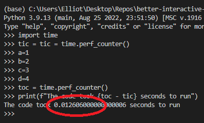
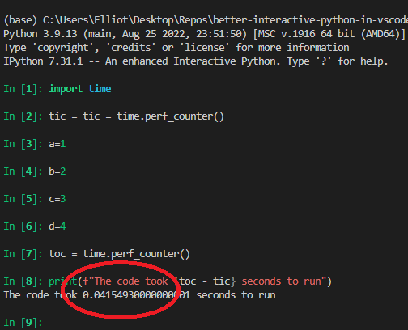

# The Problem
A frequent part of the data science workflow is executing a portion of SomePythonScript.py, and working with the results interactively. Currently in vscode, you have 3 options to do this.

However, all 3 options have critical flaws and do not behave how data scientists have become accustomed to in popular IDEs (ex. spyder, Rstudio, iPython/QTconsole, Pycharm)

**Method 1** :  "Run Selection/Line in Python Terminal". 

**Major flaw**: up/down arrow scroll through your code history line-by-line, instead of the entire code chunks. Also, no syntax coloring.

**Method 2** : "Run Selection/Line in Python Terminal" with this [popular setting/trick](https://stackoverflow.com/questions/52310689/use-ipython-repl-in-vs-code)  

**Major flaw**: line-by-line code history AND significantly slower than Method 1.

**Method 3** : "Run Selection/Line in Interactive Terminal". 

**Major flaw**: no code history function at all [details in footnote 1] , and the SLOWEST of all 3 methods 

# The Solution / My Method
For my script to work, you need 3 things:
1. Install autohotkey v1.1, and put *betterSendToPythonTerminal.ahk* in your windows startup folder
2. Change your vscode keyboard shortcut for `Terminal: Focus Terminal` to `ctrl+tick/tilde`. [see footnote 2]
3. Open ipython terminal open in vscode. [details in footnote 3]

Now `shift+enter` behaves exactly as all data scientists expect, à la Spyder/Pycharm/Rstudio!

# Advantages
|               | Code History? | speedBenchmark.py |
|---------------|---------------|-------------------|
| **Method 1**  |       ❌  (line-by-line, no syntax coloring)     |       0.0126 sec            |
| **Method 2**  |        ❌ (line-by-line)     |     0.0415 sec              |
| **Method 3**  |       ❌         |       0.4 sec           |
| **THIS METHOD** |      ✔️        |         .000045 sec         |

(benchmark results in appendix)

## Appendix: Footnotes

[1] Actually command history exists via `interactive.history.next` and `interactive.history.previous` (but the default hotkeys up/down are being overridden by other hotkeys with higher precedence!). Even if you happen to discover these, and re-bind them to new, non-conflicting hotkeys, they still don't behave correctly. Vscode is such a mess!

[2] You can do this easily by adding this to your keybindings.json: `{"key": "ctrl+`", "command": "workbench.action.terminal.focus"}` 

[3] I added *~\anaconda3\Scripts\* to my windows PATH environment variable so that all I have to do is 1. start vscode, 2. open a command terminal 3. type `ipython` and hit enter to change the windows terminal into a ipython terminal

## Appendix: Pre-requisite Steps to re-create the problem

1. install Anaconda3-2022.10-Windows-x86_64.exe 
2. install VSCodeUserSetup-x64-1.74.3.exe 
3. install Python extension v2022.20.2 

*(all are the most recent versions available as of 2022-01-16)*

## Appendix: Benchmark screenshots

